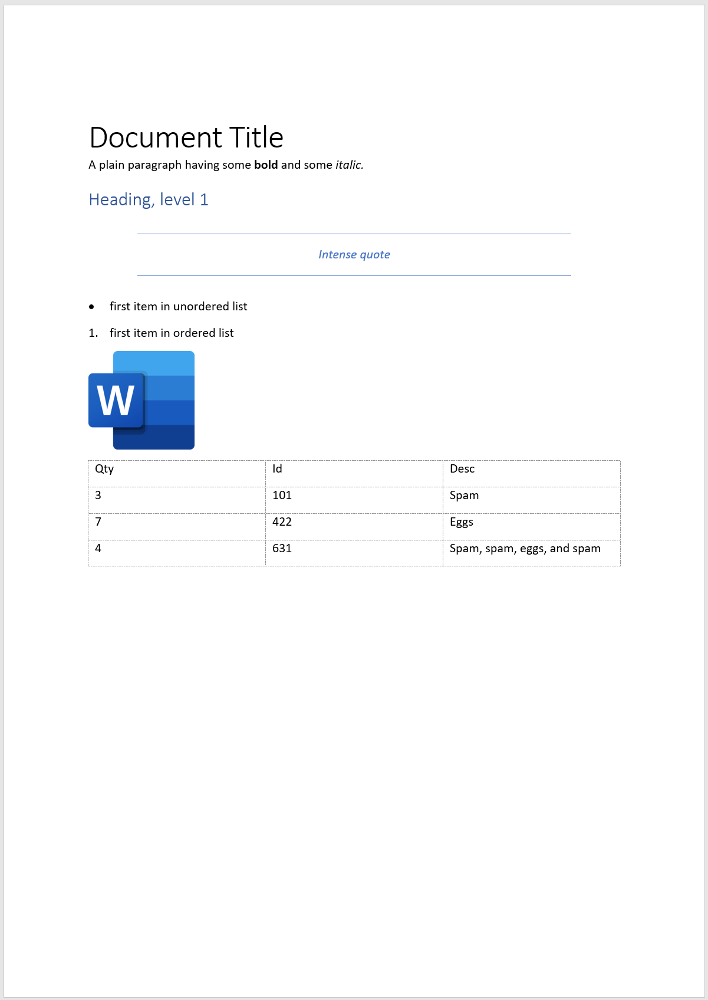

# Examples

## Basic Document Example

Use the [basic_document.py](basic_document/basic_document.py) script to generate the word file [basic_document.docx](basic_document/basic_document.docx).
The result will look like the following:

