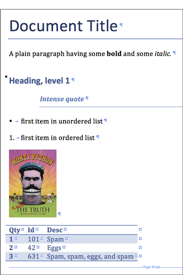

# python-docx-ng

`python-docx-ng` is a Python library for creating and updating Microsoft Word (`.docx`)
files. It is a downstream superset of
[python-docx](https://github.com/python-openxml/python-docx) — the distribution is
`python-docx-ng`, but the importable package is `docx`:

```python
from docx import Document
```

The two distributions cannot be installed side by side.

## What it can do

```python
from docx import Document
from docx.shared import Inches

document = Document()

document.add_heading("Document Title", 0)

p = document.add_paragraph("A plain paragraph having some ")
p.add_run("bold").bold = True
p.add_run(" and some ")
p.add_run("italic.").italic = True

document.add_heading("Heading, level 1", level=1)
document.add_paragraph("Intense quote", style="Intense Quote")

document.add_paragraph("first item in unordered list", style="List Bullet")
document.add_paragraph("first item in ordered list", style="List Number")

document.add_picture("monty-truth.png", width=Inches(1.25))

records = (
    (3, "101", "Spam"),
    (7, "422", "Eggs"),
    (4, "631", "Spam, spam, eggs, and spam"),
)

table = document.add_table(rows=1, cols=3)
hdr_cells = table.rows[0].cells
hdr_cells[0].text = "Qty"
hdr_cells[1].text = "Id"
hdr_cells[2].text = "Desc"
for qty, id, desc in records:
    row_cells = table.add_row().cells
    row_cells[0].text = str(qty)
    row_cells[1].text = id
    row_cells[2].text = desc

document.add_page_break()

document.save("demo.docx")
```



## Getting started

<div class="grid cards" markdown>

- **[Installation](user/install.md)** — install from PyPI with `pip` or `uv`.
- **[Quickstart](user/quickstart.md)** — open a document, add content, save it.
- **[API reference](api/docx/index.md)** — every module, class and property.
- **[Migrating from 0.9](user/migrating-from-0-9.md)** — what changed in 2.0.0.

</div>

## For language models

The documentation is published in the
[llms.txt](https://toxicphreak.github.io/python-docx-ng/llms.txt) format, with the full
text at
[llms-full.txt](https://toxicphreak.github.io/python-docx-ng/llms-full.txt). Point any
tool that reads `llms.txt` at those URLs — for example
[mcpdoc](https://github.com/langchain-ai/mcpdoc), which serves them to an editor over
MCP.
